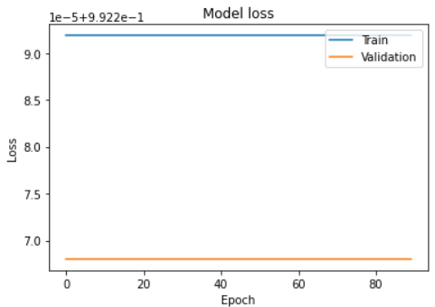

# Source Code to Algorithm - LSTM Encoder-Decoder Model

## Problem Statement

Program comprehension is important since software development is inherently collaborative and
involves many software developers. For example, code written by a developer is often evolved by
others. Prior to making changes to a piece of code, a developer needs to understand the code before
making any changes to it.Also, there are hundreds of different programming languages used in the
domain of computer science.With this vast number of languages it becomes complex for a beginner
to understand a given piece of code. These complex codes require algorithms in order for students or
other industry professionals to comprehend them better. It also saves the time of students and other
industry professionals as the algorithm is written in simple language. It provides programmers with
a detailed template for the next step of writing code in a specific programming language and helps
them to write and prepare for more complex source codes. The algorithm explains what each code
statement means, making it easier for novice Python programmers to understand the code.Hence,
we came up with the solution of ”Source Code to Algorithm Converter” with which we will be able
to solve all these problems.In This project, we aim to design and develop a web application for the
conversion of source code into the algorithm. Our converter takes in a source code by the user and
outputs an algorithm equivalent to it.By using this system the user can perform the step by step
conversion of a source code so that it will be convenient for them to understand the working of the
code and save time as the comprehending of a source code would be easy.


## Install
```
pip install numpy
```

```
pip install pandas
```
```
pip install scikit-learn
```
```
pip install keras
```

## Approach

1. **Creation of a Dataset for Source code and Algorithms** - I have curated a comprehensive dataset comprising Python programming language source code and their corresponding algorithms. Dataset has been specifically designed to facilitate research and development in the field of programming languages and artificial intelligence.
I have included only Python code in the dataset to simplify the conversion process and make it easier for researchers to work with.
2. **Load and Summarize dataset** - Load dataset from the directory & summarize the details such as no. of rows and columns & content  
3. **One-Hot Encoding** - OneHotEncoder from sklearn.preprocessing is used to convert Python code strings to numerical representation using one-hot encoding. We fit and transform the data using fit and transform methods, respectively. The resulting sparse matrix is assigned to a new DataFrame called df.
4. **Splitting dataset to train and Test** - 
Train set size = 80% of df rows, stored in train_size.  
X: all columns of df except last,  
y: last column of df.  
y is one-hot encoded, flattened.  
X and y are split into train and test sets using slicing.  
Arrays are converted to dense and reshaped into a 3D array with third dimension 1 for compatibility with LSTM architecture.
5. **Creating Encoder-Decoder Model** -
Steps to define an Encoder-Decoder LSTM neural network model using Keras:

- Define the input layer with shape (Xtrain.shape[1], Xtrain.shape[2])
- Define the encoder layer with 128 neurons using LSTM
- Define the decoder layer using RepeatVector and another LSTM layer with 128 neurons
- Define the output layer with Dense and Xtrain.shape[2] neurons, using softmax activation
- Use Model to define the overall model with inputs and outputs
- Compile the model with Adam optimizer and mean squared error loss
- The number of neurons in LSTM layers is a hyperparameter that needs to be tuned based on the problem, input data, and desired performance. In this context, the selection of 128 neurons and other relevant parameters was based on a rigorous process of experimentation and trial and error.

6. **Train and fit the model** - I have trained an Encoder-Decoder LSTM model using X_train. The model is trained for 90 iterations over the entire training set, with a batch size of 28. The validation set is X_test, and the model is evaluated on this set at the end of each epoch. The training history is stored in the history variable.
7. **Test and Evaluate the model** - The code has been evaluated the trained Encoder-Decoder LSTM model on the testing set. Predictions are made using the predict method, and performance metrics such as loss, accuracy, and F1 score are computed using scikit-learn functions. The accuracy score is high at 96.3%, but the F1 score is moderate at 0.49, indicating that the model may perform well for some classes but not for others. 
8. **Validation** - I have created a plot comparing the original and predicted values for a time series. Blue represents original values and red represents predicted values. The plot has a title, x-axis and y-axis labels, and a legend to differentiate between the lines. This plot can be used to visually assess the model's performance in predicting time series values.

 <p align="center">
        </p>

