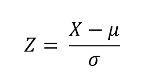
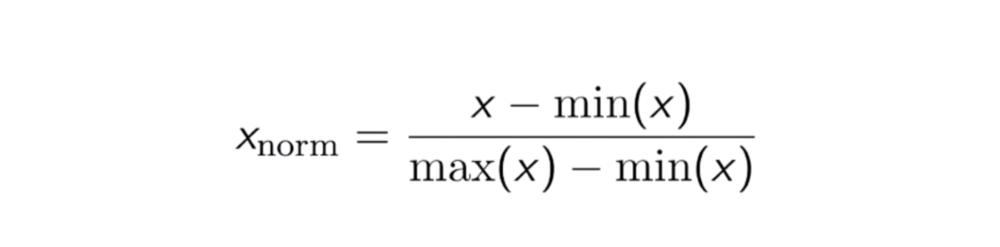

# Sale Prediction from existing customer - Logistic Regression

## Problem Statement

Given the dataset of the customer predict whether customer is going to buy the product or not

## Install

```
pip install pandas
```

```
pip install numpy
```

## Approach

1. Finding the problem Application - Predicting whether new custommer will buy this product or not
2. Collecting Databases - Based on the age , salary , existing customer Status (Purchased or not purchased)
3. Load and Summarize dataset - Load dataset from the directory & summarize the details such as no. of rows and columns & content
4. Segregating dataset into X and Y
5. Splitting dataset to train and Test
6. Feature Scaling -

- Problem -
  Since both the features have different sclaes , there is a chance that higher magnitude . This will imaoct the performance of the machine learning algorithm and obivously , we do not want our algorithm to be biassed toward one feature.
- Solution -
  we scale our data to make all the features contribute equally to the result
  Types - 
  - Standardization
        <p align="center">
        </p>
             
  Here the values are centered around mean with a unit standard deviation.This means that the mean of the attribute becomes zero and the resultant distribution has a unit standard deviation 

  - Normalization

    <p align="center">
    </p>
Normalization is a scaling technique in which values are shifted and rescaled so that they end up ranging between 0 and 1 . It is also known as the Min-Max Scaling


7. Algorithm - Logistic Regression - Uses one or more independent variables (X) to determine dependent variable (Y). 
8. Training - Training our model for Pre-Processed Dataset 
9. Validation - Obtaining the accuracy of the model 
10. Prediction - Observing how our model is classifying our new model 